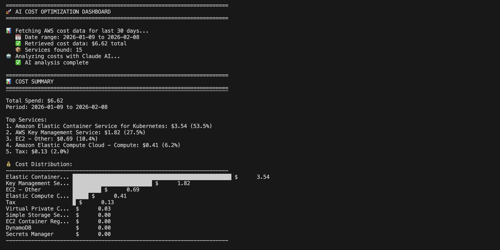
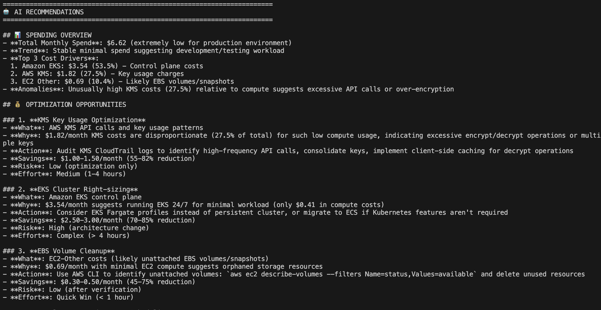

## 📊 Real-World Example

Here's the dashboard analyzing a development/testing environment:

*Visual cost distribution instantly shows EKS (53.5%) as the primary cost driver*

*Claude identifies KMS cost anomaly (27.5% of total spend) and provides specific optimization steps*

### Key Features Demonstrated:
- **Anomaly Detection**: Flagged unusual KMS costs relative to compute usage
- **ROI Prioritization**: Ranked fixes by savings/effort ratio
- **Production Awareness**: Assessed risk levels for each recommendation
- **Actionable Commands**: Provided exact AWS CLI commands to implement