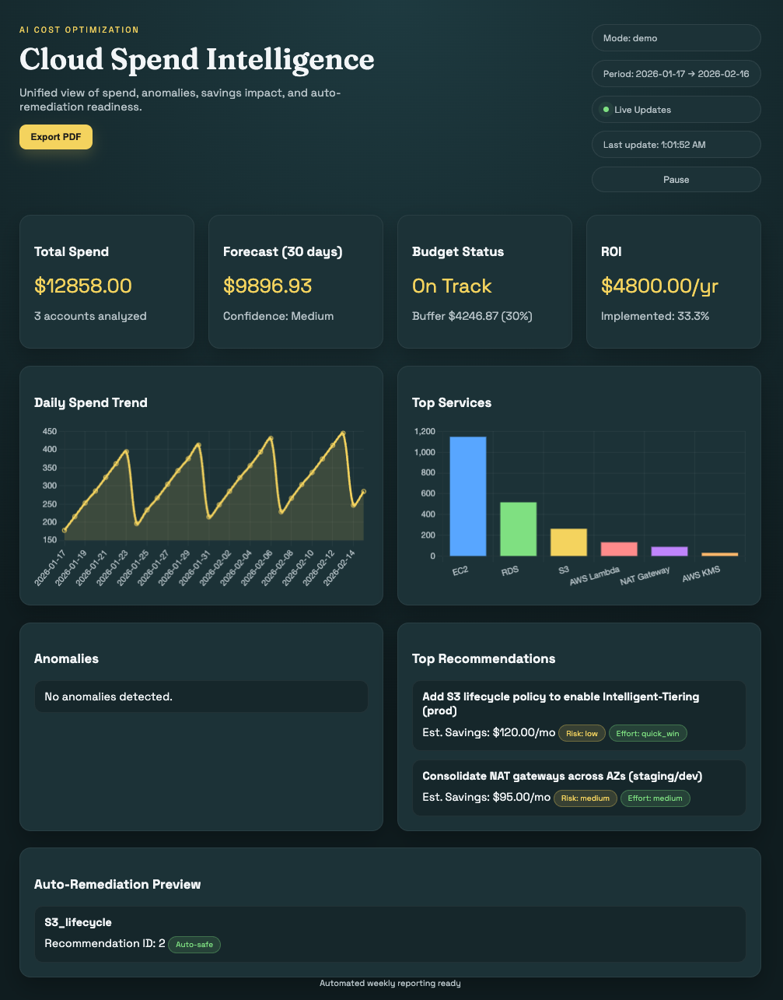

# 🤖 AI Cost Optimization Dashboard

**Automated cloud cost analysis with AI recommendations, anomaly detection, and a web dashboard**

[](https://www.python.org/)
[](https://aws.amazon.com/aws-cost-management/aws-cost-explorer/)
[](https://openai.com/)
[](https://www.anthropic.com/)
[](LICENSE)

## 🎯 Business Impact

- **Potential Savings**: Identifies optimization opportunities and estimates monthly savings
- **Operational Efficiency**: Automates recurring cost analysis and reporting workflows
- **Proactive Alerts**: Detects spend anomalies and budget risk before costs escalate

## 📊 What It Does

This tool automatically:
1. **Analyzes** AWS spending patterns using Cost Explorer API
2. **Identifies** cost-saving opportunities using a cloud-agnostic LLM
3. **Detects** spending anomalies and trend shifts
4. **Tracks** savings implementation and ROI
5. **Visualizes** everything in a web dashboard

### Sample Output

```
🤖 Weekly AWS Cost Analysis - February 7, 2025

📈 Total Spend: $8,234 (↑ 12% vs last week)

🚨 Top Recommendations:
1. EC2 i3.2xlarge instance running 24/7 with 8% CPU → Switch to t3.large
   💰 Potential savings: $320/month

2. Unused RDS snapshot from 2023 → Delete aged backup
   💰 Potential savings: $45/month

3. S3 bucket with 450GB in Standard class → Move to Intelligent-Tiering
   💰 Potential savings: $67/month

📊 Spending by Service:
- EC2: $4,200 (51%)
- RDS: $2,100 (25%)
- S3: $890 (11%)
```

### Dashboard Preview



## 🚀 Quick Start

### Prerequisites

```bash
# Required
- Python 3.11 or 3.12 (NOT 3.14 - compatibility issues)
- AWS Account with Cost Explorer enabled
- OpenAI API key (default) or Claude API key
- Slack workspace (optional for notifications)
```

### Installation

```bash
# 1. Clone this repository
git clone https://github.com/yourusername/ai-cost-optimization-dashboard.git
cd ai-cost-optimization-dashboard

# 2. Install dependencies
pip install -r requirements.txt

# 3. Configure credentials
cp .env.example .env
# Edit .env with your API keys
```

### Configuration

```bash
# .env file
AWS_REGION=us-east-1
LLM_PROVIDER=openai   # openai | anthropic | mock
OPENAI_API_KEY=sk-your-openai-key-here
OPENAI_MODEL=gpt-4.1-mini
# OPENAI_BASE_URL=https://api.openai.com/v1/responses
CLAUDE_API_KEY=sk-ant-your-key-here
CLAUDE_MODEL=claude-sonnet-4-20250514
SLACK_WEBHOOK_URL=https://hooks.slack.com/your-webhook
MONTHLY_BUDGET=1000
DASHBOARD_MODE=demo
DASHBOARD_API_TOKEN=
DASHBOARD_HOST=127.0.0.1
DASHBOARD_CACHE_TTL=60
SSE_INTERVAL=30
```

### Run It

```bash
# Test run (last 7 days)
python cost_optimizer.py

# Schedule weekly (using cron)
0 9 * * 1 /usr/bin/python3 /path/to/cost_optimizer.py
```

### Web Dashboard (Flask + Chart.js)

```bash
# Local demo mode (no AWS creds)
python app.py
```

Open `http://localhost:5000` in your browser.

```bash
# Live mode (requires AWS creds)
DASHBOARD_MODE=live python app.py
```

### Security & Caching (Recommended)

```bash
# Require an API token for /api/* and SSE
DASHBOARD_API_TOKEN=your-token-here python app.py
```

When token auth is enabled, open the UI with:
```
http://localhost:5000?token=your-token-here
```

```bash
# Cache dashboard data for 60s to avoid repeated AWS calls
DASHBOARD_CACHE_TTL=60 python app.py
```

### Real-Time Updates (SSE)

The dashboard can stream updates using Server-Sent Events.

```bash
# Default: refresh every 30 seconds
SSE_INTERVAL=30 python app.py
```

### Containerization (Docker)

```bash
# Build image
docker build -t ai-cost-optimization-dashboard .

# Run dashboard container
docker run --rm -p 5000:5000 --env-file .env \
  -e DASHBOARD_HOST=0.0.0.0 \
  ai-cost-optimization-dashboard
```

```bash
# Run CLI workflow inside container
docker run --rm --env-file .env ai-cost-optimization-dashboard python advanced_optimizer.py --demo
```

### Containerization (Docker Compose)

```bash
# Start dashboard
docker compose up --build

# Stop dashboard
docker compose down
```

### Local Testing Deployment (Recommended)

```bash
cp .env.example .env
make local-up
```

Open:
`http://localhost:5000`

If `DASHBOARD_API_TOKEN` is set:
`http://localhost:5000?token=<your-token>`

Useful local commands:
```bash
make local-logs
make local-down
```

### Terraform Deployment (AWS)

```bash
cd terraform
cp terraform.tfvars.example terraform.tfvars
terraform init
terraform plan
terraform apply
```

Deployment docs are in:
`/Users/kwame/Desktop/PERSONAL_PROJECTS/Automation/AI-Cost-Optimization-Dashboard/terraform/README.md`

Useful AWS Terraform commands:
```bash
make tf-init
make tf-plan
make tf-apply
make tf-destroy
```

### Bank-Friendly AWS Integration (Governed & Auditable)

For regulated environments, prefer a **batch + governance** approach:

1. **Source of truth**: Enable AWS **Cost & Usage Report (CUR)** to S3
2. **Analytics**: Query with **Athena** (auditable SQL)
3. **Schedule**: Run daily/hourly refresh with **EventBridge → Lambda**
4. **Storage**: Store normalized results in **S3 or RDS** for the dashboard
5. **Security**: Use IAM roles, KMS encryption, and VPC endpoints

This yields deterministic, compliant reporting while still supporting near-real-time dashboards.

### Demo Mode (No AWS Credentials Required)

```bash
# Full advanced demo with sample data + report output
python advanced_optimizer.py --demo
```

```bash
# Live run + report output
python advanced_optimizer.py --report
```

### Advanced Flags

```bash
# Add AI-powered forecast (requires configured LLM provider)
python advanced_optimizer.py --report --ai-forecast

# Generate auto-remediation plan (dry-run) + Terraform stubs
python advanced_optimizer.py --auto-remediate --generate-terraform
```

## 🏗️ Architecture

```
┌─────────────────┐
│   AWS Account   │
│  Cost Explorer  │
└────────┬────────┘
         │
         ▼
┌─────────────────┐      ┌──────────────────┐
│  Python Engine  │─────▶│  LLM Provider    │
│  (optimizers)   │      │ (OpenAI/Claude)  │
└────────┬────────┘      └──────────────────┘
         │
         ├─────────────▶ Slack Webhook (optional)
         │
         ▼
┌─────────────────┐
│  Flask Web UI   │
│  (Dashboard)    │
└─────────────────┘
```

## 📁 Project Structure

```
ai-cost-optimization-dashboard/
├── app.py                     # Flask web dashboard
├── dashboard_data.py          # Dashboard JSON payload builder
├── cost_optimizer.py          # Core optimizer (CLI)
├── advanced_optimizer.py      # Multi-feature demo runner
├── anomaly_detector.py        # Spend anomaly detection
├── cost_forecaster.py         # Cost forecasting
├── auto_remediator.py         # Terraform auto-remediation stubs
├── savings_tracker.py         # ROI tracking
├── llm_client.py              # Cloud-agnostic LLM client
├── requirements.txt           # Python dependencies
├── .env.example               # Environment variables template
├── static/                    # UI assets
├── templates/                 # UI templates
└── reports/                   # Generated reports
```

## 🔧 Technical Details

### Cloud-Agnostic LLM Providers

This project supports multiple LLM providers via `LLM_PROVIDER`:
- `openai` (default) using the OpenAI Responses API
- `anthropic` using Claude Messages API
- `mock` for demos without API calls

### AWS Permissions Required

```json
{
  "Version": "2012-10-17",
  "Statement": [
    {
      "Effect": "Allow",
      "Action": [
        "ce:GetCostAndUsage",
        "ce:GetCostForecast"
      ],
      "Resource": "*"
    }
  ]
}
```

### LLM Integration

By default, uses OpenAI Responses API. Anthropic is supported via `LLM_PROVIDER=anthropic`.

### Key Features

✅ **Automated Weekly Reports** - Set it and forget it  
✅ **AI-Powered Insights** - Smarter than threshold alerts  
✅ **Slack Integration** - Delivered where you work  
✅ **Cost Tracking** - Historical trend analysis  
✅ **Multi-Account Support** - Analyze consolidated billing  
✅ **Anomaly Detection** - Z-score + IQR for spend spikes  
✅ **ROI Prioritization** - Recommendations ranked by savings/effort  
✅ **Risk Assessment** - Production-safe optimization suggestions  
✅ **Visual Analytics** - ASCII bar charts for quick pattern recognition  
✅ **Web Dashboard** - Flask + Chart.js  
✅ **PDF Export** - Print-ready reports from the dashboard  
✅ **DRY_RUN Mode** - Test without API charges  
✅ **Error Handling** - Graceful degradation for edge cases  

## 📈 Roadmap

- [x] **Week 1**: Core functionality (cost analysis + AI recommendations)
- [x] **Week 1**: Slack integration + scheduling
- [x] **Week 1**: Historical trending + anomaly detection
- [x] **Week 1**: Visual cost distribution charts
- [x] **Week 1**: ROI-based recommendation ranking
- [x] **Week 2**: Multi-account support + savings tracker
- [x] **Week 3**: Web dashboard UI (Flask + Chart.js)
- [x] **Week 4**: Terraform auto-remediation stubs

## 🤝 Contributing

Built as part of my AI-powered DevOps portfolio. Suggestions welcome!

## 📄 License

MIT License - See [LICENSE](LICENSE) file

## 👤 Author

**Nicholas Awuni**  
DevOps Engineer | AWS + AI Automation Specialist

- GitHub: (https://github.com/nickcube2)
- LinkedIn: (https://linkedin.com/in/nicholas-awuni-6018041b1/)
- Portfolio: [Your website]

---

**💡 Why This Project?**

As a DevOps engineer, I've seen teams waste thousands on idle resources. This tool combines my AWS expertise with AI to solve a real business problem: **making cost optimization automatic and actionable**.

**Built with**: Python 🐍 | AWS Cost Explorer ☁️ | OpenAI / Claude 🤖 | Flask | Chart.js | Slack 💬
