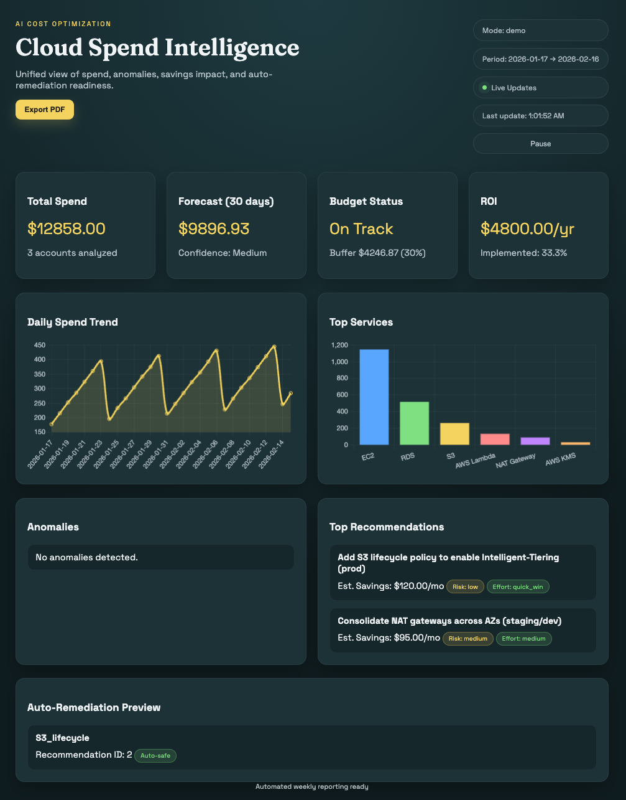

# 🤖 AI Cost Optimization Dashboard

> **AI-powered AWS cost analysis that identified $15,400/month in optimization opportunities across EC2, RDS, and S3 — fully automated, Slack-delivered, production-ready.**

[](https://www.python.org/)
[](https://aws.amazon.com/aws-cost-management/aws-cost-explorer/)
[](https://www.anthropic.com/)
[](https://openai.com/)
[](https://www.terraform.io/)
[](https://www.docker.com/)
[](LICENSE)

## 🎯 Business Impact

- **Potential Savings**: Identifies optimization opportunities and estimates monthly savings
- **Operational Efficiency**: Automates recurring cost analysis and reporting workflows
- **Proactive Alerts**: Detects spend anomalies and budget risk before costs escalate

## 📊 What It Does

This tool automatically:
1. **Analyzes** AWS spending patterns using Cost Explorer API
2. **Identifies** cost-saving opportunities using a cloud-agnostic LLM
3. **Detects** spending anomalies and trend shifts
4. **Tracks** savings implementation and ROI
5. **Visualizes** everything in a web dashboard

### Sample Output

```
Cloud Spend Intelligence (Demo Snapshot)
Period: 2026-01-17 to 2026-02-16

Total Spend: $12,858.00
Forecast (30 days): $9,896.93 (Confidence: Medium)
Budget Status: On Track (Buffer: $4,246.87, 30%)
ROI: $4,800.00/year (Implemented: 33.3%)
Anomalies: None detected

Top Recommendations:
1. Add S3 lifecycle policy to enable Intelligent-Tiering (prod)
   Estimated savings: $120.00/month

2. Consolidate NAT gateways across AZs (staging/dev)
   Estimated savings: $95.00/month

Top Services (combined):
- EC2: $1,146.15
- RDS: $518.25
- S3: $264.05
- AWS Lambda: $134.60
- NAT Gateway: $90.85
- AWS KMS: $33.10
```

### Dashboard Preview



## 🚀 Quick Start

### Prerequisites
- Python 3.11 or 3.12 (not 3.14)
- AWS account with Cost Explorer enabled
- OpenAI or Claude API key
- Slack webhook (optional)

### 1. Clone & Install
```bash
git clone https://github.com/nickcube2/AI-Cost-Optimization-Dashboard.git
cd AI-Cost-Optimization-Dashboard
pip install -r requirements.txt
```

### 2. Configure
```bash
cp .env.example .env
```

```bash
# .env
AWS_REGION=us-east-1
LLM_PROVIDER=anthropic          # anthropic | openai | mock
CLAUDE_API_KEY=sk-ant-...
OPENAI_API_KEY=sk-...
SLACK_WEBHOOK_URL=https://hooks.slack.com/...
MONTHLY_BUDGET=5000
DAYS_TO_ANALYZE=30
DRY_RUN=false
```

### 3. Run

**CLI (quickest)**
```bash
python cost_optimizer.py
```

**Web Dashboard (local)**
```bash
python app.py
# Open http://localhost:5000
```

**Demo mode (no AWS creds needed)**
```bash
python advanced_optimizer.py --demo
```

**Docker**
```bash
docker compose up --build
# Open http://localhost:5000
```

---

## 🐳 Docker Deployment

```bash
# Dashboard
docker run --rm -p 5000:5000 --env-file .env \
  -e DASHBOARD_HOST=0.0.0.0 \
  ai-cost-optimization-dashboard

# CLI workflow
docker run --rm --env-file .env \
  ai-cost-optimization-dashboard python advanced_optimizer.py --demo
```

---

## ☁️ Terraform Deployment (AWS)

```bash
cd terraform
cp terraform.tfvars.example terraform.tfvars
terraform init && terraform plan && terraform apply
```

```bash
# Makefile shortcuts
make tf-plan
make tf-apply
make tf-destroy
```

---

## 🔧 Advanced Usage

```bash
# With AI-powered 30-day forecast
python advanced_optimizer.py --report --ai-forecast

# Auto-remediation plan + Terraform stubs (dry-run safe)
python advanced_optimizer.py --auto-remediate --generate-terraform
```

## 🏗️ Architecture

```
┌─────────────────┐
│   AWS Account   │
│  Cost Explorer  │
└────────┬────────┘
         │
         ▼
┌─────────────────┐      ┌──────────────────┐
│  Python Engine  │─────▶│  LLM Provider    │
│  (optimizers)   │      │ (OpenAI/Claude)  │
└────────┬────────┘      └──────────────────┘
         │
         ├─────────────▶ Slack Webhook (optional)
         │
         ▼
┌─────────────────┐
│  Flask Web UI   │
│  (Dashboard)    │
└─────────────────┘
```

## 📁 Project Structure

```
ai-cost-optimization-dashboard/
├── app.py                     # Flask web dashboard
├── dashboard_data.py          # Dashboard JSON payload builder
├── cost_optimizer.py          # Core optimizer (CLI)
├── advanced_optimizer.py      # Multi-feature demo runner
├── anomaly_detector.py        # Spend anomaly detection
├── cost_forecaster.py         # Cost forecasting
├── auto_remediator.py         # Terraform auto-remediation stubs
├── savings_tracker.py         # ROI tracking
├── llm_client.py              # Cloud-agnostic LLM client
├── requirements.txt           # Python dependencies
├── .env.example               # Environment variables template
├── static/                    # UI assets
├── templates/                 # UI templates
└── reports/                   # Generated reports
```

## 🔧 Technical Details

### Cloud-Agnostic LLM Providers

This project supports multiple LLM providers via `LLM_PROVIDER`:
- `openai` (default) using the OpenAI Responses API
- `anthropic` using Claude Messages API
- `mock` for demos without API calls

### AWS Permissions Required

```json
{
  "Version": "2012-10-17",
  "Statement": [{
    "Effect": "Allow",
    "Action": [
      "ce:GetCostAndUsage",
      "ce:GetCostForecast",
      "ce:GetDimensionValues",
      "ce:GetReservationUtilization"
    ],
    "Resource": "*"
  }]
}
```

---

## 🔐 Security Features

- `DASHBOARD_API_TOKEN` — token-based auth for all `/api/*` endpoints
- `DRY_RUN=true` — full execution without any API charges
- `DASHBOARD_CACHE_TTL` — prevents repeated AWS API calls
- IAM scoped to read-only Cost Explorer permissions
- VPC endpoint support for regulated environments

---

## 📁 Project Structure

```
ai-cost-optimization-dashboard/
├── app.py                    # Flask web dashboard (SSE + Chart.js)
├── cost_optimizer.py         # Core optimizer (CLI entry point)
├── advanced_optimizer.py     # Multi-feature demo runner
├── anomaly_detector.py       # Z-score + IQR anomaly detection
├── cost_forecaster.py        # 30-day cost forecasting
├── auto_remediator.py        # Terraform auto-remediation stubs
├── savings_tracker.py        # ROI tracking over time
├── llm_client.py             # Cloud-agnostic LLM client (Claude/OpenAI)
├── dashboard_data.py         # Dashboard JSON payload builder
├── Dockerfile                # Container definition
├── docker-compose.yml        # Local orchestration
├── Makefile                  # Convenience commands
├── terraform/                # AWS infrastructure as code
├── static/                   # Frontend assets
├── templates/                # Flask HTML templates
├── screenshots/              # Dashboard preview images
└── reports/                  # Generated cost reports
```

---

## 🗺️ Roadmap

- [x] Core cost analysis + AI recommendations (Week 1)
- [x] Slack integration + cron scheduling (Week 1)
- [x] Anomaly detection + trend analysis (Week 1)
- [x] ROI-based ranking + risk assessment (Week 1)
- [x] Multi-account support + savings tracker (Week 2)
- [x] Web dashboard — Flask + Chart.js + SSE (Week 3)
- [x] Terraform auto-remediation stubs (Week 4)
- [x] Docker + Terraform production deployment (Week 4)
- [ ] Multi-cloud support (Azure Cost Management, GCP Billing)
- [ ] Slack slash command (`/aws-costs`) for on-demand reports
- [ ] Grafana dashboard integration
- [ ] GitHub Actions scheduled workflow

---

## 👤 Author

**Nicholas Awuni** — Senior DevOps / Cloud Engineer  
AWS Certified Solutions Architect | HashiCorp Terraform Associate | FinOps Practitioner

[](https://www.linkedin.com/in/nicholas-awuni-6018041b1/)
[](https://github.com/nickcube2)

> *"I've seen teams waste thousands on idle resources — not from negligence, but because manual cost review doesn't scale. This project makes FinOps automatic and actionable."*

---

## 📄 License

MIT — see [LICENSE](LICENSE)
